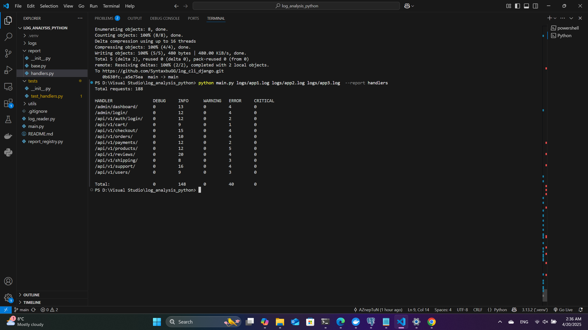

```markdown
# Django Log Analyzer CLI

Простой CLI-инструмент для анализа логов Django-приложения и формирования отчётов.

---

## 📦 Возможности

- Обработка одного или нескольких `.log` файлов
- Генерация отчётов (пока доступен только отчёт `handlers`)
- Поддержка параллельной обработки больших логов
- Гибкая архитектура: легко добавлять новые типы отчётов
- CLI-интерфейс только на стандартной библиотеке (`argparse` и др.)

---

## 📑 Формат команды


Пример:

```bash
python3 main.py logs/app1.log logs/app2.log --report handlers
```

---

## 📊 Отчёт `handlers`

Анализирует все строки логов вида `django.request` и группирует:

- по имени ручки (endpoint)
- по уровню логирования (`DEBUG`, `INFO`, `WARNING`, `ERROR`, `CRITICAL`)

Пример вывода:

```
Total requests: 1000

HANDLER                DEBUG   INFO    WARNING ERROR   CRITICAL
/admin/dashboard/      20      72      19      14      18
/api/v1/auth/login/    23      78      14      15      18
...
                      178     494     96      116     116
```

---

## 🛠 Установка и запуск

1. Убедитесь, что у вас установлен Python 3.9+
2. Клонируйте репозиторий:

```bash
git clone https://github.com/SyntaxbuGG/django-log-analyzer.git .
cd log_cli_django

```

3. Запустите анализ:

```bash
python3 main.py logs/app1.log logs/app2.log --report handlers
```

---

## 🧪 Тестирование

Для запуска тестов:

```bash
pytest
```

(Тесты находятся в директории `tests/`)

---

## 📁 Структура проекта

```
.
├── main.py                  # Точка входа
├── report/
│   ├── __init__.py
│   ├── base.py              # Абстрактный базовый класс
│   ├── handlers.py          # Реализация отчёта handlers
│   └── registry.py          # Регистрация доступных отчётов
├── utils/
│   ├── __init__.py
│   └── reader.py            # Чтение логов с параллельной обработкой
├── tests/                   # Тесты на pytest
└── README.md
```

---

## 🧩 Добавление нового отчёта

1. Создайте файл в `report/`, например `top_errors.py`
2. Создайте класс, унаследованный от `BaseReport`, реализуйте `process()` и `display()`
3. Зарегистрируйте отчёт в `report/registry.py`

Пример:

```python
from .top_errors import TopErrorsReport

REPORTS = {
    "handlers": HandlersReport,
    "top_errors": TopErrorsReport,  # добавили новый
}
```


## 📎 Зависимости

- Только стандартная библиотека Python (`argparse`, `concurrent.futures`, `re` и pytest)


## 👨‍💻 Автор

SyntaxbuGG – Python backend developer

---
